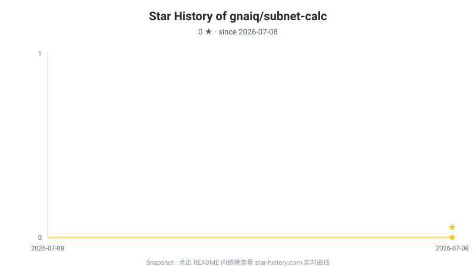

# 子网计算工具 · subnet-calc

> 一个用 Rust + [egui](https://github.com/emilk/egui) / [eframe](https://github.com/emilk/egui) 编写的跨平台桌面子网计算工具，界面原生支持中文。

[](https://www.rust-lang.org/)
[](LICENSE)
[](https://github.com/gnaiq/subnet-calc)

## ✨ 功能特性

- **基础计算 (Basic)**：输入 `IP/掩码`（也支持 `IP 掩码`、纯 IP），计算网络地址、广播地址、子网掩码、反掩码 (wildcard)、CIDR、总地址数 / 可用地址数、首末可用主机、IP 地址类别（A/B/C/D/E）及是否私有地址。支持全角数字、全角点号与多余空格的自动归一化。
  - 支持**批量模式**：每行输入一个网段，一次性计算全部并展示结果。批量模式和单条模式均自动记录到历史。
- **IP 校验 (Check)**：判断 `IP 是否属于某子网`、`两个子网是否包含 / 重叠`，并可对多个子网做**路由聚合 (aggregate)**，输出合并后的超网。
- **进制转换 (Convert)**：IPv4 地址在「点分十进制 / 二进制 / 十六进制 / 整数」四种表示之间互转。
- **VLSM 分配 (VLSM)**：给定基础网段与若干主机数需求，按最大块优先依次分配，输出每个子网的网段、掩码与可用范围；空间不足的需求会被列出失败原因。
- **导出功能**：支持将计算结果导出为 JSON、CSV 或 Markdown 格式；批量模式下可一键导出全部结果。
- **计算历史**：自动记录每次计算（含批量），支持查看、回填、清空历史。

## 🚀 快速开始

需要 Rust 工具链（建议 stable 最新版）：

```bash
cargo run --release      # 运行（带优化）
cargo build --release    # 仅构建，产物在 target/release/subnet-calc
cargo test               # 运行单元测试用例（核心逻辑 131 用例）
```

> **Linux 提示**：eframe 依赖原生窗口后端，通常需安装系统库，例如
> `libxkbcommon`、`libwayland-client`、`libx11`、`libfontconfig`（具体包名随发行版而异）。

## 📁 项目结构

```
src/
  main.rs            # 应用入口与窗口配置
  theme.rs           # UI 主题配色
  core/              # 纯计算核心（无 UI 依赖，带单元测试）
    ip.rs            # IPv4 解析、类别、私有/回环判断、进制转换
    mask.rs          # 掩码 <-> CIDR 互转、反掩码
    subnet.rs        # 子网分析主逻辑
    vlsm.rs          # VLSM 分配
    aggregate.rs     # 包含 / 重叠 / 聚合
    normalize.rs     # 全角与空格归一化
    export.rs        # JSON / CSV / Markdown 格式导出
    history.rs       # 计算历史持久化（JSON 文件存储）
    error.rs         # 错误类型
  ui/                # egui 界面（四个标签页）
assets/
  cjk_font.otf       # 内置中文字体，保证中文 UI 正常显示
  icon.png           # 应用图标（用于窗口标题栏 / 任务栏）
```

计算核心与界面解耦，且自带单元测试，便于在不启动 GUI 的情况下验证正确性。

## 🧪 测试

```bash
cargo test
```

核心计算逻辑（子网分析、IP 校验、路由聚合、进制转换、VLSM 分配、归一化）均覆盖单元测试。

## 📄 License

基于 [MIT 许可证](LICENSE) 开源。Copyright (c) 2026 Life Bitterness.

## ⭐ Star History

[](https://star-history.com/#gnaiq/subnet-calc&Date)

> 上图为仓库创建初期的快照（当前 0 ★）。点击图表可跳转 [star-history.com](https://star-history.com/#gnaiq/subnet-calc&Date) 查看实时星标曲线。star-history 服务端偶有限流，实时图恢复后亦可直接访问该链接。
